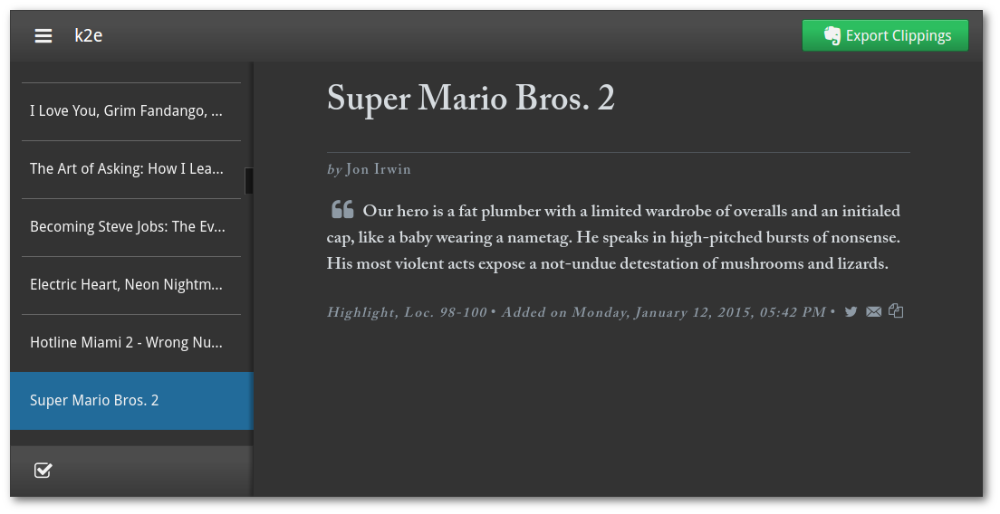
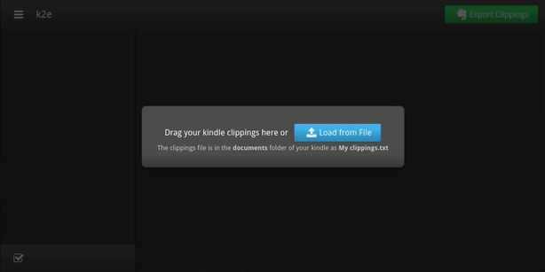
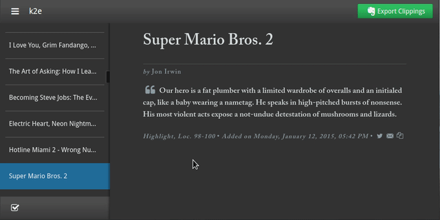
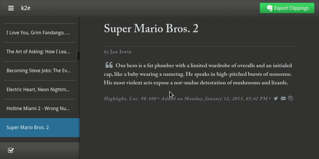

# k2e

Browse your kindle clippings and export them to evernote, [try it out](https://k2e.apphb.com).

Built with [enyojs](http://enyojs.com/), [babel](https://babeljs.io/), ASP.NET(eugh), and :heart:.



## Basic Usage

### Loading Clippings

Drag and drop, or select the text file containing your clippings when starting the app. Your clippings are stored **locally** for the duration of your session.

:information_source: Kindle clippings are stored in the `My Clippings.txt` text file located in the kindle's `documents` folder (on kindle keyboard at least).

 

### Exporting Clippings to Evernote

Click on the `Export Clippings` button on the upper right to export **all** clippings. To export a **selection** of clippings click on checkmark button on the lower left, select your clippings, and then click on the `Export Selected Clippings` on the upper right:



### Settings

Click on the upper left burger button to fiddle with fonts, font size, text margin, and to revoke the app's evernote permissions. Settings are stored **locally**.




### Keyboard Shortcuts

Key          | Action
-------------|-------------------------
<kbd>j</kbd> | select next clipping
<kbd>k</kbd> | select previous clipping
<kbd>f</kbd> | toggle fullscreen

## Building

You will need node, npm, gulp, mono-complete, mono-xsp4, and a mongoDB database.

To build:

* `npm install`
* `bower install`
* Get C# package dependencies by opening the project solution in monodevelop and selecting `Project > Restore NuGet Packages`, or by running `mono nuget.exe restore k2e/packages.config -PackagesDirectory packages` (needs `nuget.exe`, [instructions](https://docs.nuget.org/consume/nuget-faq))
* You will need to set your [evernote OAuth](https://dev.evernote.com/doc/articles/authentication.php) **consumer key and secret**, and a **url** for a mongoDB database. You can place an `EvernoteCredentials.config` file inside the `k2e` folder (it will be copied over to the `dist` folder when executing the `dist` task) to set configuration options. A minimal example for development follows, all options are presented in the [next section](#configuration-options).

```xml
<?xml version="1.0"?>
<appSettings>
  <add key="PublicKey" value="<OAuth consumer key>"/>
  <add key="SecretKey" value="<OAuth consumer secret>"/>
  <add key="MongoConnectionString" value="mongodb://127.0.0.1/k2e"/>
</appSettings>

```

**Dist**

* `gulp dist` will create a distributable under the `dist` folder
* `cd dist && xsp4` will run a server for the distributable

**Build**

* `gulp build` will build a debug version of the ASP.NET app, and compile scripts and stylesheets
* `cd k2e && xsp4` will run a server for the debug version


## Configuration Options

Key                            | Description
-------------------------------|-------------------------
`PublicKey`                    | OAuth consumer key
`SecretKey`                    | OAuth consumer secret
`Production`                   | Will use production evernote url if not empty
`DeploymentMongoConnectionKey` | The key name of a key-value pair containing a mongo URI, used for deployment. Default value is `MONGOLAB_URI`. If the key-value pair has a non-empty value it will be used as the url for the mongo database
`MongoConnectionString`        | Used to connect to a local mongo installation, taken into account if the value of the key-value pair with the key name defined in `DeploymentMongoConnectionKey` is empty. Default value is `mongodb://127.0.0.1/k2e`
`AppHbDeployment`              | Used to indicate if the app runs on AppHarbor